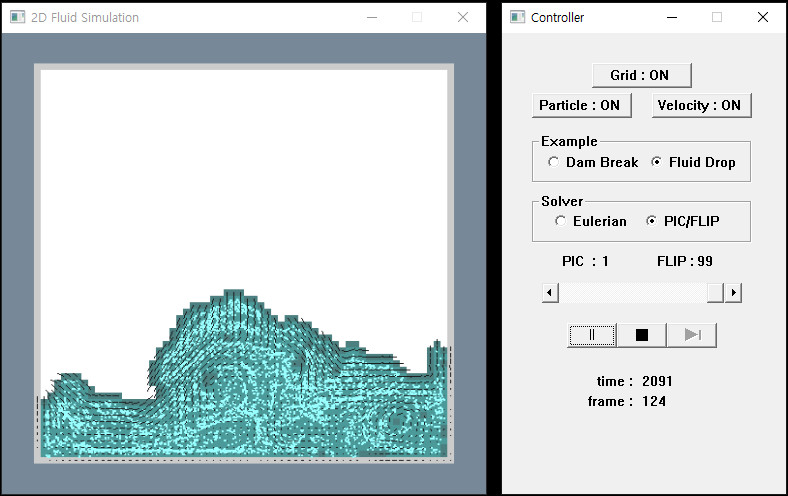

# DXViewer
## Overview
DXViewer is a DirectX 12 framework for physics simulation. This viewer makes it easy to visualize your simulation.

## Usage
Use the contents in the DXViewer-x.x.x folder. The files in the **example** folder show how to use them.

```c++
int WINAPI WinMain(HINSTANCE hInstance, HINSTANCE prevInstance, PSTR cmdLine, int showCmd)
{
    AdhocSimulation* fluidsim = new AdhocSimulation();

    DX12App* dxapp = new DX12App();
    dxapp->setCameraProperties(
        PROJ::PERSPECTIVE, 
        0.0f,               // orthogonal distance
        2.0f, 0.0f, 0.0f);  // radius, theta, phi
    dxapp->setBackgroundColor(DirectX::Colors::LightSlateGray);

    Win32App winApp(500, 500);
    winApp.setWinName(L"Adhoc Simulation");
    winApp.initialize(hInstance, dxapp, fluidsim);

    return winApp.run();
}
```

### ISimulation
ISimulation is an interface that makes your simulation class compatible with DXViewer. You should implement this interface using your simulation class. The following is the abstract methods that should be implemented.

#### Simulation methods
* void iUpdate()
* void iResetSimulationState(std::vector<ConstantBuffer>& constantBuffer)

#### Mesh methods
* std::vector<Vertex>& iGetVertice()
* std::vector<unsigned int>& iGetIndice()
* UINT iGetVertexBufferSize()
* UINT iGetIndexBufferSize()
* DirectX::XMINT3 iGetObjectCount()
* DirectX::XMFLOAT3 iGetObjectSize()
* DirectX::XMFLOAT3 iGetObjectPositionOffset()
  
#### DirectX methods
* void iCreateObject(std::vector<ConstantBuffer>& constantBuffer)
* void iUpdateConstantBuffer(std::vector<ConstantBuffer>& constantBuffer, int i)
* void iDraw(Microsoft::WRL::ComPtr<ID3D12GraphicsCommandList>& mCommandList, int size, UINT indexCount, int i)
* void iSetDXApp(DX12App* dxApp)
* UINT iGetConstantBufferSize()
* bool iIsUpdated()

#### WndProc methods
* void iWMCreate(HWND hwnd, HINSTANCE hInstance)
* void iWMCommand(HWND hwnd, UINT msg, WPARAM wParam, LPARAM lParam, HINSTANCE hInstance)
* void iWMHScroll(HWND hwnd, WPARAM wParam, LPARAM lParam, HINSTANCE hInstance)
* void iWMTimer(HWND hwnd)
* void iWMDestory(HWND hwnd)

## Build
This repo was developed in the following environment:
* Windows 10 64-bit
* Microsoft Visual Studio 2019 on x64 platform (C++14)
* CMake 3.19.0

There are already built files(.lib, .dll and .cso) in the **DXViewerx.x.x** folder, so use them.
  
## Application
|[GridLiquid2D](https://github.com/jklee95/GridLiquid2D)|
|:---:|
||

|[FLIPEngine3D](https://github.com/jklee95/FLIPEngine3D)|
|:---:|
||


## Reference
* Frank Luna. 2016. _Introduction to 3D Game Programming with DirectX 12_. Mercury Learning and Information.
